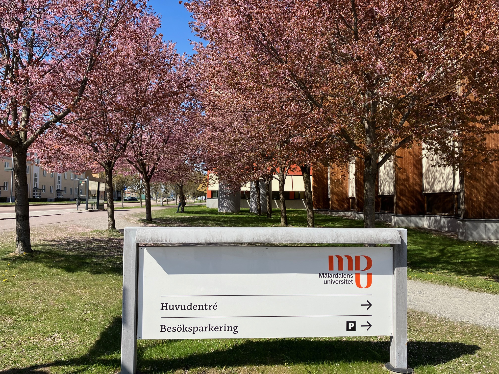

<!--  -->

# HCC2023

**Workshop on Human Centric Cybersecurity HCC2023**

**[Mälardalen University](https://www.mdu.se/en/malardalen-university), Västerås, Sweden**

**August 24th, 2023**

## About

We are organizing the Workshop on human centric cybersecurity to use the knowledge and experience of the experts in the field and strengthen our knowledge on human-centric research. 
We invited experts in the field to …

## Confirmed Speakers
<!-- FIXME Check the links -->
<!-- <a href="https://www.tudelft.nl/staff/s.e.parkin/?cHash=ef8a6923cb175152ae46a2749ee95259" style="color: black; text-decoration: underline;text-decoration-style: dotted;">Simon Parkin, TU Delft</a> -->
#### [Simon Parkin](https://www.tudelft.nl/staff/s.e.parkin/?cHash=ef8a6923cb175152ae46a2749ee95259), TU Delft 
**Title:** TBA

**Abstract:** TBA

**Bio:** TBA

#### [Gabriele Lenzini](), University of Luxembourg
**Title:** TBA

**Abstract:** TBA

**Bio:** TBA

#### [Paolo Masci](https://www.nianet.org/directory/research-staff/paolo-masci/),Research Scientist and Principal AssociateFrom NASA Langley Research Center
**Title:** TBA

**Abstract:** TBA

**Bio:** TBA

## Schedule
TBA

## Place
<!-- FIXME Insert teams link -->
Milos, MDU, Västerås (also available online: Teams link)

## Organizers:
[Marjan Sirjani](http://www.es.mdu.se/staff/3242-Marjan_Sirjani)

[Kristina Lundqvist](http://www.es.mdu.se/staff/180-Kristina_Lundqvist)

[Cristina Seceleanu](http://www.es.mdu.se/staff/173-Cristina_Seceleanu)

[Zahra Moezkarimi](https://www.mdu.se/staff?id=zmi01)

## Contact Info
Marjan Sirjani

Email: marjan.sirjani@mdu.se

Room: U1-066C

Phone: +46736620517

